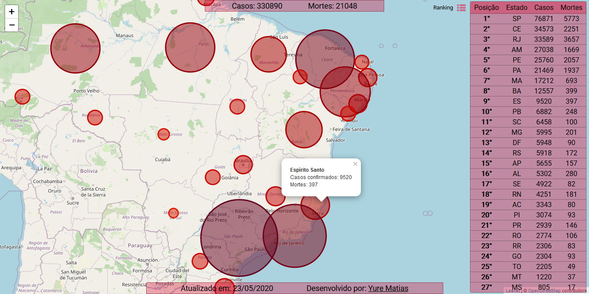

<h1 align="center">
     COVID-19 Brazil Map
</h1>

<h3 align="center">
    Real time map of the COVID-19 cases and deaths in Brazil 
</h3>

<p align="center">
    
</p>

<h4 align="center">
    <strong>
        Source of data:
    </strong>
    <a href="https://github.com/devarthurribeiro/covid19-brazil-api">devarthurribeiro/covid19-brazil-api</a>
</h4>

<hr>

## Project setup
```
yarn install
```

### Compiles and hot-reloads for development
```
yarn serve
```

### Compiles and minifies for production
```
yarn build
```

### Lints and fixes files
```
yarn lint
```

### Customize configuration
See [Configuration Reference](https://cli.vuejs.org/config/).
